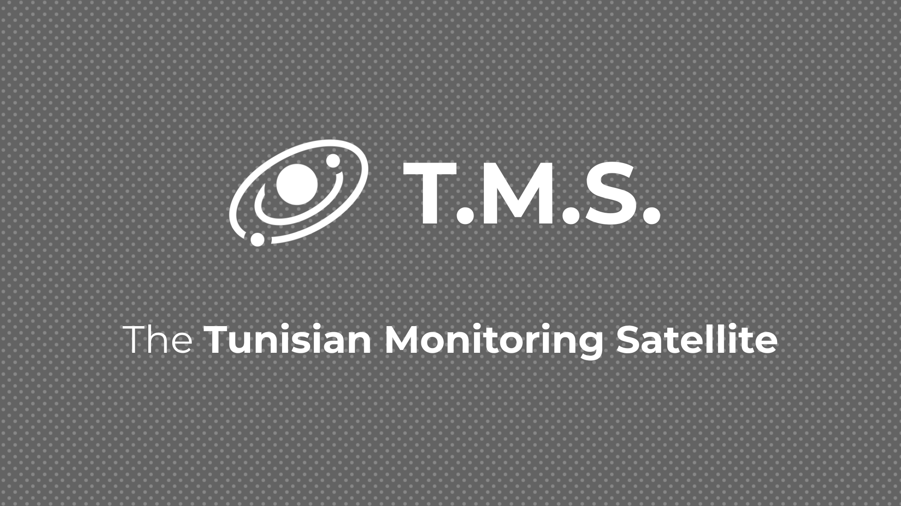

# TMS-301 Autonomous CubeSat System

## TMS-301: Tunisian Monitoring Satellite — 3U CubeSat Mission

The **TMS-301 (Tunisian Monitoring Satellite)** is a **3U CubeSat** designed for **hyperspectral imaging** applications.  
Its primary mission is to perform **high-resolution environmental and agricultural monitoring** from Low Earth Orbit (LEO).

The spacecraft integrates **commercial off-the-shelf (COTS)** components with **custom subsystems** for:

- autonomous data handling
- real-time power and communication management
- onboard safety through **AI-driven anomaly detection & decision-making**

TMS-301 also introduces an **experimental AI agent (LLM)** acting as the high-level system manager, supported by fast, reliable, low-level anomaly detectors.  
This architecture aims to **prevent early-orbit mission failures**, especially the critical cases of:

- **failure to power up**, and
- **communications/telemetry loss**

---

# Repository Structure

```
TMS-301/
│
├── Hardware_Electronics/
│
├── Power_Failure_Detection/
│
├── Comms_Failure_Detection//
│
├── System_AI_Agent/ (coming soon)
│
├── T.M.S. Datasheet/
│
└── README.md
```

---

# About the System Datasheet

The **TMS-301 full datasheet** is one of the most important documents in the repository.  
It provides **clear technical grounding** for the engineering design.  
The datasheet covers:

- Complete component list
- On-Board Computer (OBC) specifications
- Power subsystem
- Communication subsystem
- Navigation & positioning
- Payload
- FPGA subsystem
- Microcontroller
- Energy profile
- Mission life cycle

It is the **reference document** for engineering.

[TMS-301 Datasheet](https://github.com/anonymous-sb/tms-301/blob/master/TMS-301%20Datasheet.pdf)

---

# System Architecture Overview

The system is built as three main layers:

- Hardware Layer
  Handles sensing, data flow, power delivery, and communication. It provides the raw telemetry and system states used by the upper layers.

- AI Anomaly Detection Layer
  Continuously monitors power and communication signals. Detects irregular patterns and generates alerts for potential failures.

- LLM Decision Layer
  Receives summarized telemetry and anomaly alerts, evaluates the situation, and proposes safe corrective actions. All actions pass through a rule-based arbiter before execution.

These layers work together to provide real-time monitoring, early fault detection, and autonomous decision-making.

---

# Broader Impact & Real-World Relevance

### Applications

- Earth observation
- agricultural monitoring
- environmental tracking
- university missions
- government programs
- commercial imaging constellations

### Why It Matters

Most CubeSat failures occur due to:

- poor power management
- communication failures
- lack of onboard autonomy

TMS‑301 directly addresses these issues.

---

# Scalability

- Works from 3U → 12U
- Works for hyperspectral, thermal, SAR, comms payloads
- Can be extended to **constellation coordination** in the future

---

# Conclusion

TMS‑301 blends traditional CubeSat engineering with **AI‑driven autonomy**, providing a realistic architecture for preventing power and communication failures in early orbit while supporting high‑value hyperspectral imaging operations.
